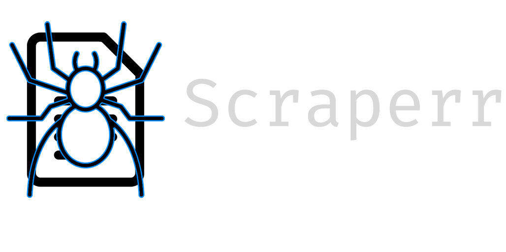
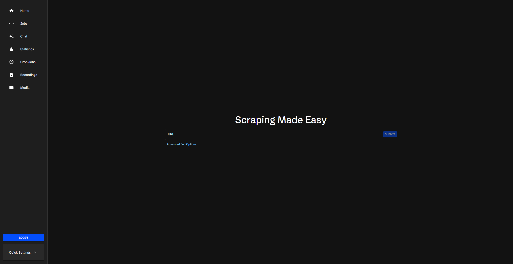

<div align="center">
  

  **A powerful self-hosted web scraping solution**

  <div>
    
    
    
    
    
  </div>
</div>

> ⚠️ **Maintained fork.** This is a community-maintained fork of the
> [original Scraperr](https://github.com/jaypyles/Scraperr) (archived Oct 2025).
> We keep it alive: refreshed dependencies, Docker builds, and bug fixes.

## 📋 Overview

Scrape websites without writing a single line of code.

<div align="center">
  
</div>

## ✨ Key Features

- **XPath-Based Extraction**: Precisely target page elements
- **Queue Management**: Submit and manage multiple scraping jobs
- **Domain Spidering**: Option to scrape all pages within the same domain
- **Custom Headers**: Add JSON headers to your scraping requests
- **Media Downloads**: Automatically download images, videos, and other media
- **Results Visualization**: View scraped data in a structured table format
- **Data Export**: Export your results in markdown and csv formats
- **Notification Channels**: Send completion notifications through various channels

## 🧱 Tech Stack

- **Backend:** FastAPI (Python 3.10, PDM), SQLAlchemy, SQLite (default, `DATABASE_URL` overridable)
- **Frontend:** Next.js 14 / TypeScript, TailwindCSS, Redux
- **Scraping engines:** requests-html, selenium-wire, Playwright, Camoufox
- **Auth:** JWT (email/password) + optional OpenAI (LLM) assistant

## 🚀 Getting Started

### Docker (recommended)

```bash
docker compose up -d
```

- Frontend: http://localhost:3000
- API docs: http://localhost:8000/docs

The first build takes a while (the API image installs Playwright + Camoufox
browsers). To use the pre-built images from Docker Hub instead, run:

```bash
docker compose -f docker-compose.hub.yml up -d
```

### Configuration (optional)

| Variable | Default | Purpose |
|----------|---------|---------|
| `NEXT_PUBLIC_API_URL` | `http://scraperr_api:8000` | API URL used by the Next.js server-side proxy |
| `SERVER_URL` | `http://scraperr_api:8000` | API URL used in server-side props |
| `DATABASE_URL` | `sqlite+aiosqlite:///data/database.db` | SQLAlchemy connection string |
| `OPENAI_KEY` | _(empty)_ | Enables the AI assistant feature |
| `DEFAULT_USER_EMAIL` / `DEFAULT_USER_PASSWORD` | _(empty)_ | Pre-seeded admin user |

## 💬 Support & Custom Work

**This fork is actively maintained.** Need a custom scraper/parser for your site,
a specific feature, or help with self-hosting?

- 🤖 **Telegram:** [@medbot1_bot](https://t.me/medbot1_bot)
  > Нужен кастомный парсер или доработка? Напиши нашему боту.
- 🗂 **Portfolio:** [github.com/Ant19801108](https://github.com/Ant19801108)
- 🌐 **Main site:** [Ant Mystik](http://207.180.196.145/)

**❤️ Support this fork** (hosting + maintenance are community-funded):

- **ETH (Ethereum / ERC-20):** `0x8AFC3Cc28fFC4cde92D13Bf6DAf6447f5227CF93`
- **USDT (TON):** `UQAgrUTTUyDnKbC2gQsusk4Fk7n6Nu86Sx8X5rT14FqsrF64`

## ⚖️ Legal and Ethical Guidelines

When using Scraperr, please remember to:

1. **Respect `robots.txt`**: Always check a website's `robots.txt` file to verify which pages permit scraping
2. **Terms of Service**: Adhere to each website's Terms of Service regarding data extraction
3. **Rate Limiting**: Implement reasonable delays between requests to avoid overloading servers

> **Disclaimer**: Scraperr is intended for use only on websites that explicitly permit scraping. The creator accepts no responsibility for misuse of this tool.

## 📄 License

This project is licensed under the MIT License. See the [LICENSE](LICENSE) file for details.

## 👏 Contributions

Development made easier with the [webapp template](https://github.com/jaypyles/webapp-template). Contributions and bug reports are welcome.
